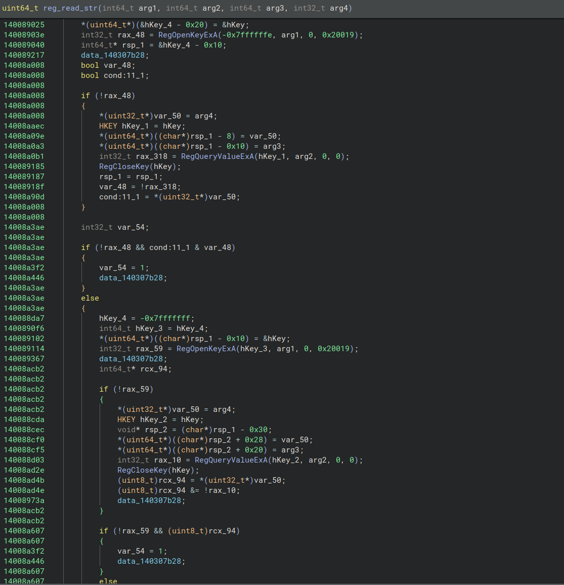

  

# DispatchThis

> Flattened the graph? DispatchThis! An IL-level deobfuscator for an **indirect jump + indirect call + control flow flattener**, built as 
> a [Binary Ninja](https://binary.ninja/) Workflow.

> [!WARNING]
> **Educational Proof of Concept.**
> Treat it as an example of IL-level deobfuscation inside a Binary
> Ninja workflow. See [`docs/known-issues.md`](docs/known-issues.md) for additional context.
> Pull requests are welcome!

## What it does

The target obfuscator flattens control flow with a **compare-tree dispatcher** keyed on a
32-bit **state variable**, and routes between the original blocks through **decode-gadget
indirect jumps** (`jump(reg)`, where the destination is recovered from a relocated jump
table at run time). DispatchThis recovers the original control flow **entirely at
the IL level** - every transformation is an *IL expression rewrite* performed inside a
clone of Binary Ninja's `core.function.metaAnalysis` workflow. **No bytes are ever
patched.**

> [!NOTE]
> **Why a workflow / IL rewriting?** Replacing IL expressions with Binary Ninja Workflows
is incredibly versatile: whole expressions and control-flow edges, unconditional jumps and conditional expressions
> are replaced in the IL following state to Original Basic Block resolution, ultimately eliminating
> the need to patch assembly - a process that can be incredibly burdensome.

For the full obfuscation breakdown including indirect jumps, opaque predicates, control flow flattening w/ a 32-bit-state
constant, and indirect call gadgets from the sample, see [`docs/obfuscation.md`](docs/obfuscation.md).

## See it in action

**Before - analysis stalls at the first indirect jump.** Because every transition routes through
a `jump(reg)` whose target is computed at run-time, the disassembler cannot follow control flow
past the first jump gadget, and most of the function is never recovered:

**After the indirect-jump resolver - control flow reconnected.** Each `jump(reg)` has been decoded and rewritten to a direct branch, so Binary Ninja discovers the remaining blocks and the real graph re-emerges:

**Recovered pseudocode.** With the jumps resolved, control flow deflattened, jump gadgets cleaned up, state write instructions NOP'd, and indirect calls resolved, the function decompiles to readable pseudocode:

## Installation

### Prerequisites

- Binary Ninja (see [Compatibility](#compatibility)).
- **[Z3](https://github.com/Z3Prover/z3) must be installed** in the Python environment
  Binary Ninja uses - the deflattener relies on it to reconstruct conditional
  (cmov-selected) transitions. Install it with `pip install z3-solver` into that
  interpreter.

### Install the plugin

Copy the folder located in the "plugins/DispatchThis" directory into your Binary Ninja user plugins directory and 
restart Binary Ninja.

For example: `~/.binaryninja/plugins/DispatchThis`

| OS | Plugins path |
| --- | --- |
| **macOS** | `~/Library/Application Support/Binary Ninja/plugins/` |
| **Linux** | `~/.binaryninja/plugins/` |
| **Windows** | `%APPDATA%\Binary Ninja\plugins` |

## Usage

The passes are enabled per-function from the **Function Settings** context menu. With the target function open in a disassembly or graph view, **right-click anywhere inside the function** and choose **Function Settings**. Two plugin entries appear:

- **Indirect Jumps/Calls** - enables the indirect-jump and indirect-call resolvers for this
  function. Once enabled, reanalysis runs automatically and the Control Flow Graph will
  visibly *grow* in the disassembly view as each resolved jump reconnects previously
  unreachable blocks. Re-runs to a fixpoint, so the graph keeps expanding until no more
  targets can be decoded. If reanalysis does not trigger automatically, run it manually via
  *Analysis ▸ Reanalyze All Functions*.

- **Deflatten** - enables the deflattener and the cleanup NOP pass together. The deflattener
  rebuilds the original control flow graph, and the NOP pass then removes the dead decode
  gadgets and state writes. The result is a cleaner function in the pseudocode view with the
  dispatcher overhead stripped out. If reanalysis does not trigger automatically, run it
  manually via *Analysis ▸ Reanalyze All Functions*.

**Deflatten depends on Indirect Jumps/Calls.** Run the resolver first (or together) so the
full CFG is visible before the deflattener tries to reconstruct state-machine edges. The NOP
cleanup only fires after the deflattener has rewritten the dispatcher exits, so enabling
Deflatten alone without first resolving the indirect jumps is a no-op on most flattened
functions.

## Pipeline at a glance

Four workflow activities run per function, in order. The first resolves indirect jumps at
**LLIL**; the rest run at **MLIL**:

1. **Indirect jump resolver** (LLIL) - rewrites each decode-gadget `jump(reg)` into
   `jump(const)` so Binary Ninja discovers the target as code and reconnects the CFG.
   Re-runs to a fixpoint as the function grows.
2. **Indirect call resolver** (MLIL) - folds each import call's decode and rewrites the
   call destination to a constant pointer, recovering the callee prototype.
3. **Deflattener** (MLIL, *opt-in*) - recovers the state machine and rewrites each
   `OBB → dispatcher` jump into a direct `goto` to the real successor. Conditional
   (cmov-selected) transitions are reconstructed into the original `if`/branch control
   flow, using Z3 to recover the routing predicate.
4. **Cleanup / NOP pass** (MLIL, *opt-in*) - converts any remaining resolved gadget jumps
   to gotos, collapses the always-true opaque predicates, and NOPs the dead jump gadgets
   and state writes.

Full details, ordering rationale, and the `session_data` contract are in
[`docs/pipeline.md`](docs/pipeline.md). The conditional/Z3 path has its own write-up in
[`docs/conditional-deflattening.md`](docs/conditional-deflattening.md). A file-by-file map
of the source is in [`docs/files.md`](docs/files.md).

## The sample

This project was built and tested against a single sample, `FortiEndpoint_Patch.exe`.

> [!CAUTION]
> Only analyze in an isolated environment:
>
> - **VirusTotal:** <https://www.virustotal.com/gui/file/0da123adf9251957a4b850a3f6bd6a753dd4892be176a84a18450e899534cc5e>
> - **SHA-256:** `0da123adf9251957a4b850a3f6bd6a753dd4892be176a84a18450e899534cc5e`

## Compatibility

Built and tested on **Binary Ninja 5.3.9757 (a99f2380)**. The workflow and IL-rewriting
features it depends on were introduced in **3.3.3996 (2023-01-18)**, which is effectively
the minimum version required to support IL re-writes. It has only been exercised on 5.3.9757,
however, so earlier releases may behave differently.

## Credits

Though this project is an entire new code-base, it was inspired after I studied the behavior of 
[RPISEC/llvm-deobfuscator](https://github.com/RPISEC/llvm-deobfuscator).

## License

Released under the [MIT License](LICENSE).
