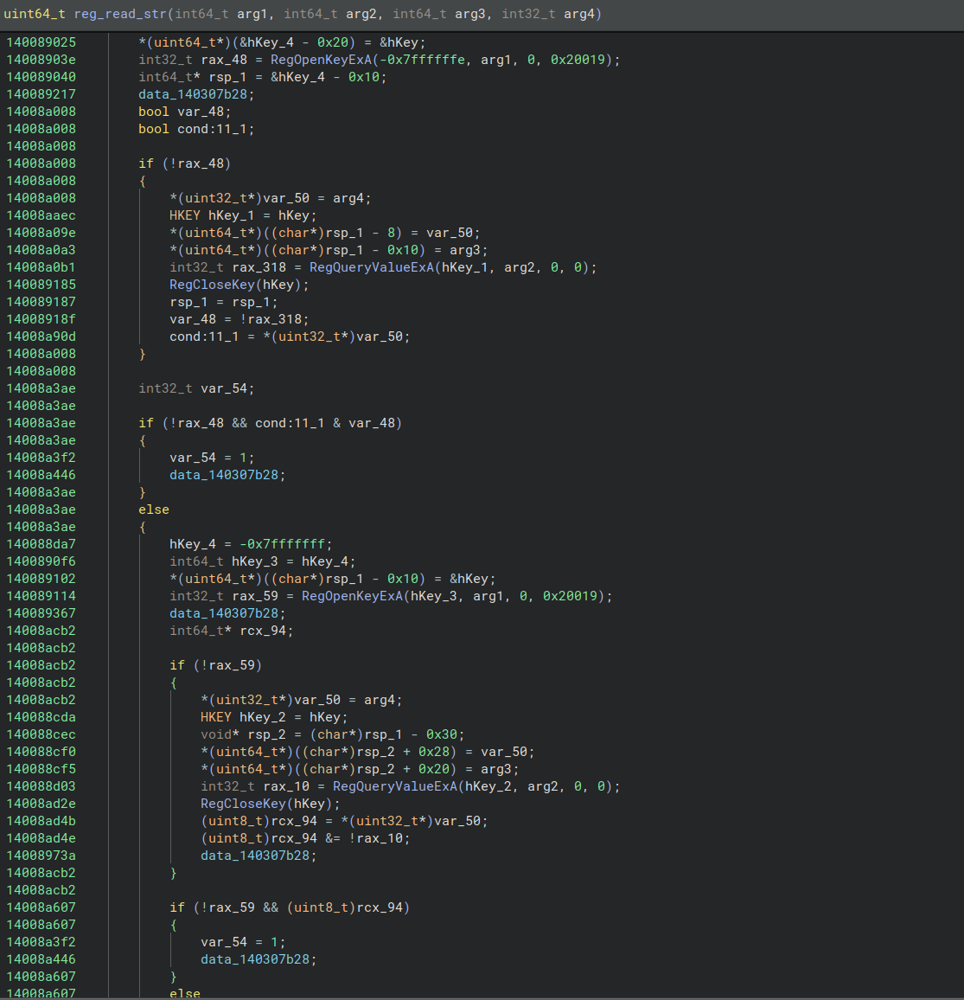

  

# DispatchThis

> Your obfuscating compiler can **DispatchThis** 😛
> A multi-shape IL-level deobfuscator for **control-flow flattening, indirect jumps, and
> indirect calls**, built as
> a [Binary Ninja](https://binary.ninja/) Workflow.

> [!WARNING]
> **Educational Proof of Concept.**
> Treat it as an example of IL-level deobfuscation inside a Binary
> Ninja workflow. See [`docs/known-issues.md`](docs/known-issues.md) for additional context.
> Pull requests are welcome!

## What it does

Control-flow flattening replaces a function's real branches with a **dispatcher** that
decides what runs next from a **state value**, so every original basic block routes back
through it instead of to its real successor. DispatchThis recovers the original control
flow **entirely at the IL level** - every transformation is an *IL expression rewrite*
performed inside a clone of Binary Ninja's `core.function.metaAnalysis` workflow. **No
bytes are ever patched.**

> [!NOTE]
> **Why a workflow / IL rewriting?** Replacing IL expressions with Binary Ninja Workflows
> is incredibly versatile: whole expressions and control-flow edges, unconditional jumps,
> and conditional expressions are replaced after resolving states to original basic blocks.
> This eliminates the need to patch assembly, which can be considerably more burdensome.

### Three flattener shapes

Flatteners differ enough that one parameterised solver would not hold up, so each
**shape** is a self-contained solver picked by a per-function toggle:

| Mode | The construction | State | Blocks chained by |
| --- | --- | --- | --- |
| **`OLLVM_INDIRECT_32`** + **`INDIRECT_JUMP_CALL`** | compare-tree dispatcher routing on **COMPARE EQUAL** / **COMPARE NOT EQUAL**; indirect recovery must reconnect the CFG before deflattening | 32-bit, one variable | **indirect jumps** through decode gadgets |
| **`OLLVM_DIRECT_32`** | binary-search or linear equality dispatcher, including a shared back-edge join before the comparison head | 32-bit, one plain variable (no XOR or state encoding) | direct jumps |
| **`OLLVM_XOR_64`** | binary search tree over a state rebuilt by a 64-bit **XOR** at the dispatcher head | 64-bit, **split across a register pair** | direct jumps |

The concept they share is the **state map** - state value to original block. How that map
is built is what varies. `OLLVM_DIRECT_32` and `OLLVM_XOR_64` both reason about an original
block's entire forward region, but the former tracks one unencoded 32-bit value while the
latter resolves two 64-bit halves and XORs them. `OLLVM_XOR_64` also has symbolic
`base + displacement` compare values whose base is supplied by the caller.
The Forti construction requires both `INDIRECT_JUMP_CALL` recovery and the
`OLLVM_INDIRECT_32` solver: decode-gadget jumps and calls must be resolved before its
dispatcher can be solved at all.

#### `OLLVM_DIRECT_32`: plain state, direct back-edges

This mode targets the flattened AdaptixC2 payload in the patched `PulseSecure.exe` sample.
Its construction is close to `OLLVM_XOR_64`, except that the dispatcher reads one plain
32-bit state variable and the transition value is not XOR-encoded. The solver therefore
uses the XOR64 shape's architectural model rather than the sample-specific helpers from
`OLLVM_INDIRECT_32`:

- find the maintained state through dispatcher-local copy chains, even when every equality
  leaf compares a different temporary;
- map equality leaves and infer implicit/default leaves by routing observed state values
  through the comparison tree;
- build a forward region for each original basic block and resolve only state definitions
  that can reach that region's dispatcher exit without being overwritten;
- reconstruct local conditional diamonds and selections made outside the region and carried
  in through an SSA phi;
- handle both high-fan-in binary-search dispatchers and the variant where all back-edges
  first merge into one block that jumps to a low-fan-in linear equality chain; and
- rewrite the recovered exits directly at MLIL, leaving the dispatcher unreachable without
  running indirect-jump resolution or decode-gadget cleanup.

The path-sensitive state-definition filter matters in this sample because the register used
for the outer state is reused by nested flattened loops. Treating every write in the region
as an outer transition creates false conditional states and leaves the outer dispatcher
reachable.

Full breakdowns: [`docs/obfuscation.md`](docs/obfuscation.md) covers the indirect 32-bit
shape (indirect jumps, opaque predicates, flattening, indirect call gadgets), and
[`docs/obfuscation-xor64.md`](docs/obfuscation-xor64.md) covers the split-state XOR shape.
The Direct32 construction and its two dispatcher layouts are summarized above.
The framework itself - the contract, the registry, and how to add a shape - is in
[`docs/shapes.md`](docs/shapes.md).

## See it in action

The walkthrough below is the `OLLVM_INDIRECT_32` shape, where the indirect jumps are what
defeat analysis in the first place.

**Before - analysis stalls at the first indirect jump.** Because every transition routes through
a `jump(reg)` whose target is computed at run-time, the disassembler cannot follow control flow
past the first jump gadget, and most of the function is never recovered:

**After the indirect-jump resolver - control flow reconnected.** Each `jump(reg)` has been decoded and rewritten to a direct branch, so Binary Ninja discovers the remaining blocks and the real graph re-emerges:

**Recovered pseudocode.** With the jumps resolved, control flow deflattened, jump gadgets cleaned up, state write instructions NOP'd, and indirect calls resolved, the function decompiles to readable pseudocode:

## Installation

### Prerequisites

- Binary Ninja (see [Compatibility](#compatibility)).
- **[Z3](https://github.com/Z3Prover/z3)** in the Python environment Binary Ninja uses,
  installed with `pip install z3-solver` into that interpreter. It is required by
  `OLLVM_INDIRECT_32`, which uses it to classify and rebuild conditional (cmov-selected)
  transitions. `OLLVM_DIRECT_32` and `OLLVM_XOR_64` do not use Z3 - their conditional
  handling is structural - so those shapes work without it.

### Install the plugin

Copy the folder located in the `plugins/DispatchThis` directory into your Binary Ninja user
plugins directory, then restart Binary Ninja.

For example: `~/.binaryninja/plugins/DispatchThis`

| OS | Plugins path |
| --- | --- |
| **macOS** | `~/Library/Application Support/Binary Ninja/plugins/` |
| **Linux** | `~/.binaryninja/plugins/` |
| **Windows** | `%APPDATA%\Binary Ninja\plugins` |

## Usage

Everything is enabled per-function from the **Function Settings** context menu. With the
target function open in a disassembly or graph view, **right-click anywhere inside the
function** and choose **Function Settings**. Four plugin entries appear:

- **`INDIRECT_JUMP_CALL`** - the indirect-jump and indirect-call resolvers only, leaving any
  dispatcher intact. Once enabled, reanalysis runs automatically and the Control Flow Graph
  will visibly *grow* in the disassembly view as each resolved jump reconnects previously
  unreachable blocks. Re-runs to a fixpoint, so the graph keeps expanding until no more
  targets can be decoded. Useful on its own for a function whose jumps are obfuscated but
  whose control flow is not flattened.

- **`OLLVM_INDIRECT_32`** - deflatten a function with a 32-bit dispatcher state whose blocks
  are chained by decode-gadget indirect jumps. The Forti sample needs both this deflattener
  and the `INDIRECT_JUMP_CALL` recovery stages, because the dispatcher cannot be recovered
  until those resolvers reconnect the CFG. Enabling `OLLVM_INDIRECT_32` automatically runs
  the `INDIRECT_JUMP_CALL` stages, so a second manual checkbox is not required. It then
  rewrites the dispatcher exits and runs the cleanup pass, which erases the dead decode
  gadgets and state writes so the pseudocode comes out with the dispatcher overhead stripped.

- **`OLLVM_DIRECT_32`** - deflatten a function with one unencoded 32-bit state and ordinary
  direct back-edges. This mode covers both a high-fan-in binary-search dispatcher and a
  shared-back-edge join followed by a linear equality chain. It also handles conditional
  transitions selected locally or carried in from an earlier SSA diamond. No indirect
  resolver or gadget cleanup is run. Once every recovered exit points to its real successor,
  Binary Ninja drops the now-unreachable dispatcher; some dead state writes can remain.

- **`OLLVM_XOR_64`** - deflatten a function whose 64-bit state is split across a register
  pair and recombined with XOR at the dispatcher head. There are no indirect jumps or calls
  in this shape, so the resolvers do not apply and nothing else needs enabling. Deflattening
  leaves the dispatcher and the compare tree unreachable and Binary Ninja drops them, but the
  per-block state writes remain - there is no cleanup pass for this shape yet.

Pick **one** mode per function; they select different solvers. If reanalysis does not
trigger automatically, run it manually via *Analysis ▸ Reanalyze All Functions*. Binary
Ninja loads the plugin module and its workflow at startup, so restart Binary Ninja after
updating the plugin; reanalysis alone does not load changed Python source.

## Pipeline at a glance

Four workflow activities run per function, in order, each gated on the modes it applies to.
The first resolves indirect jumps at **LLIL**; the rest run at **MLIL**:

1. **Indirect jump resolver** (LLIL) - rewrites each decode-gadget `jump(reg)` into
   `jump(const)` so Binary Ninja discovers the target as code and reconnects the CFG.
   Re-runs to a fixpoint as the function grows.
   *Runs for `INDIRECT_JUMP_CALL` and `OLLVM_INDIRECT_32`.*
2. **Indirect call resolver** (MLIL) - folds each import call's decode and rewrites the
   call destination to a constant pointer, recovering the callee prototype.
   *Runs for `INDIRECT_JUMP_CALL` and `OLLVM_INDIRECT_32`.*
3. **Deflattener** (MLIL) - resolves the mode enabled on the function and dispatches to
   that shape's solver, which recovers the state map and rewrites each
   `OBB → dispatcher` exit into a direct `goto` - or, for a conditional transition, back
   into real `if`/branch control flow.
   *Runs for any selected flattener mode; one activity, three solvers.*
4. **Cleanup / NOP pass** (MLIL) - converts any remaining resolved gadget jumps to gotos,
   collapses the always-true opaque predicates, and NOPs the dead jump gadgets and state
   writes. *`OLLVM_INDIRECT_32` only* - it identifies gadgets by signature, reading any
   constant wider than 32 bits as a decode key, which is every state constant in
   `OLLVM_XOR_64`. `OLLVM_DIRECT_32` has no decode gadgets and does not run this pass either.

Full details, ordering rationale, and the `session_data` contract are in
[`docs/pipeline.md`](docs/pipeline.md). The shape framework is in
[`docs/shapes.md`](docs/shapes.md), the Indirect32 conditional/Z3 path in
[`docs/conditional-deflattening.md`](docs/conditional-deflattening.md), and the XOR-64
shape's solver in [`docs/obfuscation-xor64.md`](docs/obfuscation-xor64.md). A file-by-file
map of the source is in [`docs/files.md`](docs/files.md).

## The samples

One sample per shape, each the only one that shape has been exercised against.

> [!CAUTION]
> Only analyze in an isolated environment.

**`INDIRECT_JUMP_CALL` + `OLLVM_INDIRECT_32`** - `FortiEndpoint_Patch.exe`. Both processing
stages are required for this sample: the former reconnects gadget-obfuscated jumps and calls,
and the latter recovers the 32-bit state machine and removes the dispatcher:

- **`INDIRECT_JUMP_CALL` / `OLLVM_INDIRECT_32` technical write-up:** [Fortinet Vulnerability CVE-2026-35616 and EKZ Stealer: Attacking Obfuscating Compilers with Binary Ninja Workflows](https://www.esentire.com/blog/fortinet-vulnerability-cve-2026-35616-and-ekz-stealer-attacking-obfuscating-compilers-with-binary-ninja-workflows)
- **VirusTotal:** <https://www.virustotal.com/gui/file/0da123adf9251957a4b850a3f6bd6a753dd4892be176a84a18450e899534cc5e>
- **SHA-256:** `0da123adf9251957a4b850a3f6bd6a753dd4892be176a84a18450e899534cc5e`
- Reference function: `0x140088ad0` (`reg_read_str`).

**`OLLVM_DIRECT_32`** - a maliciously patched OPSWAT `wa_3rd_party_host_64.exe`, whose replaced `.text` region contains an AdaptixC2 payload:

- **VirusTotal:** <https://www.virustotal.com/gui/file/cf6dd15baf5ef66432a95b5a2ec64ba5c6de565b3fb9e10ae01b1a91612a1c2c>
- **SHA-256:** `cf6dd15baf5ef66432a95b5a2ec64ba5c6de565b3fb9e10ae01b1a91612a1c2c`
- Main flattened entry: `sub_14002754f`; its body begins near `0x1400457bf`.
- Binary-search reference: `sub_14004c83f` (dispatcher near `0x14004c89f`).
- Shared-back-edge/linear-chain reference: `sub_14003f88f` (join at `0x14003fd37`,
  comparison head at `0x14003f8a9`).
- Other regression target: `sub_14003d72f`, which contains nested flattened loops that
  reuse the outer state register.

**`OLLVM_XOR_64`** - a Microsoft Copilot Chromium stub (`mscopilot.exe`) carrying a `.text`
implant:

- **VirusTotal:** <https://www.virustotal.com/gui/file/d2e55213a02fd16a077298c986130522eb63196bdf8a8c1aec0eed6ef318b222>
- **SHA-256:** `d2e55213a02fd16a077298c986130522eb63196bdf8a8c1aec0eed6ef318b222`
- Reference function: `sub_14024849c`, central dispatcher at `0x140248513`.

## Compatibility

Built and tested for **Binary Ninja 5.3.9757+**. The workflow and IL-rewriting
features it depends on were introduced in **3.3.3996 (2023-01-18)**, which is effectively
the minimum version required to support IL re-writes. It has only been exercised on 5.3.9757+,
however, so earlier releases may behave differently.

## Credits

Though this project is an entirely new codebase, it was inspired by studying the behavior of
[RPISEC/llvm-deobfuscator](https://github.com/RPISEC/llvm-deobfuscator).

## License

Released under the [MIT License](LICENSE).
